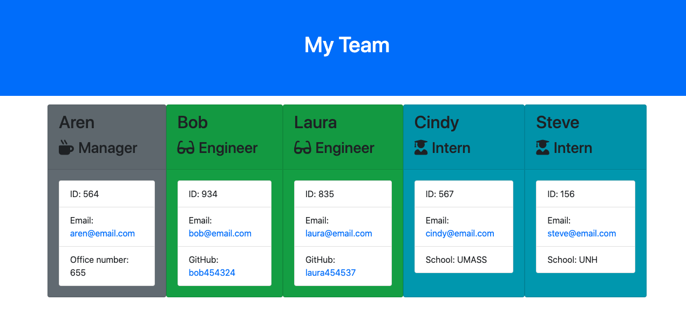

# TeamProfileGenerator

## Walkthrough Video https://drive.google.com/file/d/1ref8Cg8kmGbzj8Es_81-CHA3mpY4k06P/view?usp=sharing

## Git Hub Repository https://github.com/arensalmela/TeamProfileGenerator

### Instructions

- Build a software engineering team generator through a command line applicaiton.
- The application prompts a user for a team manager and specific employee roles.
- Application must pass unit and validation tests.
- Once the user has finished their inputs, an HTML file will be generated showing the employee roster.

## Background

- All classes pass tests.
- Manager, engineer, and intern classes extend the Employee class.
- The different employee types should all inherit some methods and properties from a base class of employee
- Employee roles each have a HTML template.

## Minimum Requirements

- Functional application.
- GitHub repository with a unique name and a README describing the project.
- User can use the CLI to generate an HTML page that displays information about their team.
- All tests must pass.

